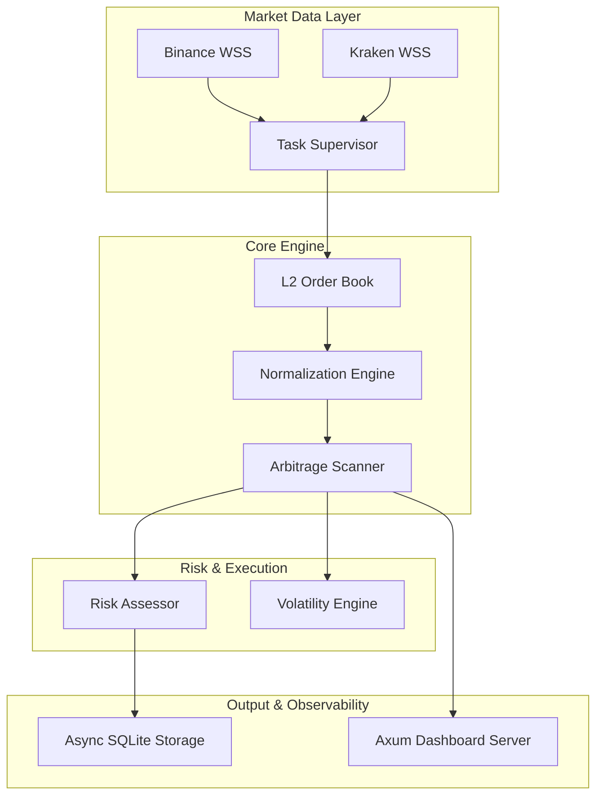

# Quantum Arbitrage Engine v5.0.0

An institutional-grade, low-latency cryptocurrency arbitrage engine built in Rust. Designed for high-frequency price discovery across multiple venues with real-time L2 order book modeling and financial-grade fixed-point precision.

## 🛡️ Institutional Hardening (v5.0.0)

This engine has been refactored for production survivability, moving beyond simple price aggregators to direct exchange connectivity.

*   **Financial Precision**: Utilizes `rust_decimal` for all PnL and execution logic to eliminate IEEE-754 rounding errors.
*   **L2 Depth Modeling**: Simulates execution by "walking the book" across the top 20 levels of liquidity, ensuring realistic slippage estimation.
*   **Asset Normalization**: Handles stablecoin parity (USDT/USD/USDC) to prevent "ghost spreads" during depeg events.
*   **Self-Healing Architecture**: A supervised task system monitors exchange feeds and automatically restarts WebSocket connections with exponential backoff.
*   **Async Persistence**: A producer-consumer pipeline decouples the sub-millisecond detection loop from SQLite disk I/O.

## 🏗️ System Architecture



## 🚀 Getting Started

### Prerequisites
*   **Rust Toolchain**: [Install Rust](https://rustup.rs/) (v1.75+)
*   **SQLite**: The engine uses a local file-based database for persistence.

### Installation
1.  Clone the repository:
    ```bash
    git clone <repository-url>
    cd crypto_arbitrage
    ```
2.  Build the project:
    ```bash
    cargo build --release
    ```

### Running the Engine
Execute the following command to start the market data ingestion and scanning loop:
```bash
cargo run
```

The engine will automatically:
1.  Initialize the SQLite database (`arbitrage.db`).
2.  Establish WebSocket connections to Binance and Kraken.
3.  Start the Axum dashboard server on port `3000`.

## 📊 Dashboard Access

Once the engine is running, open your browser to:
👉 **[http://localhost:3000](http://localhost:3000)**

**Dashboard Features:**
*   **Venue Matrix**: Real-time net spread heatmap across all connected exchanges.
*   **Opportunity Ledger**: A chronological record of detected profitable routes.
*   **L2 Depth Visualizer**: Real-time view of the order books being scanned.
*   **Spread Tape**: Rolling historical performance chart.

## ⚙️ Configuration

Core parameters can be adjusted in `src/main.rs`:
*   **Trade Size**: Default is `0.1 BTC` (`dec!(0.1)`).
*   **Scan Interval**: Real-time updates occur as fast as exchange WebSockets emit events (typically 100ms).
*   **Profit Threshold**: Minimum net percentage to trigger a signal (default 0.05%).

## ⚠️ Disclaimer
This software is provided for educational and research purposes. Cryptocurrency arbitrage carries significant risk, including market volatility, exchange counterparty risk, and technical execution failures. Use with real capital at your own risk.
